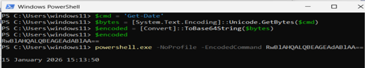
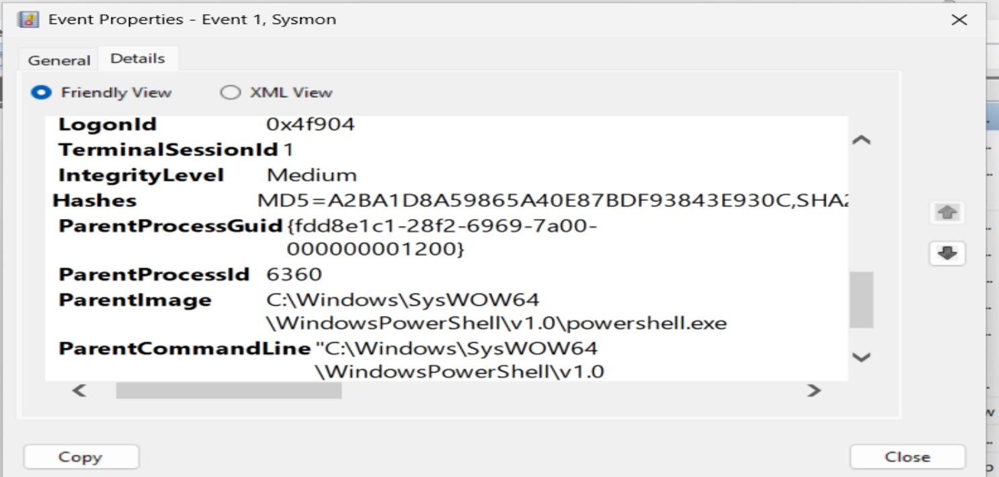

### Suspicious PowerShell Execution

#### 1. Objective
Detect and analyse suspicious PowerShell activity using Sysmon on a Windows 11 endpoint.  
The `-EncodedCommand` flag is associated with obfuscation and malicious script execution.  
*(Sysmon provides more focused telemetry than standard Windows Event Viewer.)*
#### 2. PowerShell Script Used to Encode the Command
### Steps
- `$cmd = 'Get-Process'`  
  Defines the command to encode.
- `$bytes = [System.Text.Encoding]::UTF8.GetBytes($cmd)`  
  Converts the text into UTF‑8 bytes.
- `$encoded = [Convert]::ToBase64String($bytes)`  
  Converts the bytes into a Base64 string.
- `$encoded`  
  Prints the encoded string.
- `"C:\Windows\System32\WindowsPowershell\v1.0\powershell.exe" -NoProfile -EncodedCommand RwBlAHQALQBEAGEAdABlAA==`  
  Executes PowerShell with the encoded payload, triggering Sysmon Event ID 1.
#### Screenshot

#### 3. Detection Summary
A PowerShell process executed an encoded command with execution policy bypass:
- Detection Source: Sysmon (Event ID 1 – Process Creation)  
- Endpoint: Windows 11 VM  
- User Account: windows11 (local)  
- Process: `powershell.exe`  
- Command Line: Included the `-EncodedCommand` parameter  
#### 4. Sysmon Event Details
Sysmon logged the following fields:
- **Image:**  
  `C:\Windows\System32\WindowsPowerShell\v1.0\powershell.exe`
- **CommandLine:**  
  `"C:\Windows\System32\WindowsPowershell\v1.0\powershell.exe" -NoProfile -EncodedCommand RwBlAHQALQBEAGEAdABlAA==`
- **ParentImage:**  
  `powershell.exe`
- **User:**  
  Local user account – windows11
- **Hashes:**  
  `SHA256=6A7SF3DDA06163BB6253E4F82A283E184D70755C067633C4190FBFF64F0BAECDIMPH9F91C97560360686D37B0E311BB88D64`

**Decoded Base64 Payload:**  
`Get-Date`

#### Screenshot

#### 5. Analysis
Encoded PowerShell commands are commonly used by attackers to evade detection.  
Although the decoded command (`Get-Date`) was benign, the execution technique mirrors real world malware behaviour: encoded commands, execution policy bypass and PowerShell as a LOLBin. This combination is suspicious and requires correlation with additional telemetry.
#### 6. Recommendations
- Create a SIEM detection rule to alert on any use of `-EncodedCommand`.  
- Add enrichment to automatically decode Base64 during triage.  
- Monitor for repeated encoded PowerShell executions, especially from unusual parent processes.  
- Correlate with: Network activity, Registry modifications, File writes and Additional process creation events  
#### 7. Conclusion
This activity would be classified as suspicious and warrant further investigation in a production SOC environment.  
The technique is high‑risk even when the payload is benign.
#### 8. Additional Lessons Learned
- PowerShell misinterpreted the bytes and decoded `Get-Date` as `Get-Datu`.  
- Encoding inconsistencies can cause malformed commands.   
